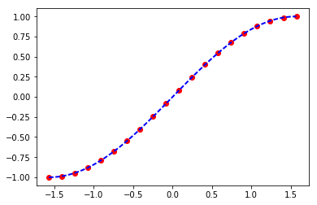
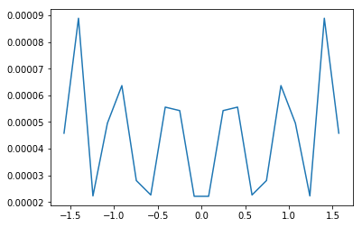

# 多项式

多项式函数是变量的整数次幂与系数的乘积之和

$ f(x)=a_nx^n+a_{n-1}x^{n-1}+...+a_2x^2+a_1x+a_0 $

在numpy中可以用一个一维数组表示x各项的系数

numpy提供了`polynomial`模块专门处理多项式的


## 基本用法:


```python
import numpy as np
import matplotlib.pyplot as plt
import random
```


```python
%matplotlib inline
```

### 多项式求值

可以用polynomia.polynomia()将系数转化为一元多项式对象,之后就可以像用函数一样用它了,比如下面的函数:

$$ f(x)=1+2x+3x^2  $$


```python
v1 = np.array([1,2,])
```


```python
from numpy.polynomial import Polynomial as P
```


```python
p = P(v1)
```


```python
p
```


    Polynomial([ 1.,  2.], [-1,  1], [-1,  1])


注意，长版本的打印输出有三个部分。
第一个是系数，第二个是域，第三个是窗口：,他们分别可以通过访问属性p.coef,p.domain和p.window获得

要求x在某个值时f(x)的值,只要简单的代入就行


```python
p(0)
```


    1.0


```python
p(1)
```


    3.0


多项式是天生的universal function,他的参数可以是一个序列


```python
p(np.array([1,2,3,4]))
```


    array([ 3.,  5.,  7.,  9.])


## 多项式运算

### 初等变换

一个多项式可以通过与一个非字符串的数值序列相加或者乘以一个标量来获得一个新的多项式


```python
p*2 #与标量相乘,多项式系数全部与标量相乘,类似向量与标量乘法
```


    Polynomial([ 2.,  4.], [-1.,  1.], [-1.,  1.])


```python
p+p # 与多项式相加,对应系数相加
```


    Polynomial([ 2.,  4.], [-1.,  1.], [-1.,  1.])


```python
p+(2,5) # 与另一个序列相加,相当于把序列作为多项式,对应系数相加
```


    Polynomial([ 3.,  7.], [-1.,  1.], [-1.,  1.])


```python
p*p # 与多项式相乘各项一一相乘,然后相同次数的系数相加
```


    Polynomial([ 1.,  4.,  4.], [-1.,  1.], [-1.,  1.])


```python
p**2 # 幂,与乘法规则相同
```


    Polynomial([ 1.,  4.,  4.], [-1.,  1.], [-1.,  1.])


除法:
`//`是多项式类的除法运算符，在这方面，多项式被视为整数.与之对应的是求余%,表示除后余下的项


```python
p//P([-1,1]) #相当于多项式分解
```


    Polynomial([ 2.], [-1.,  1.], [-1.,  1.])


```python
p%P([-1,1])
```


    Polynomial([ 3.], [-1.,  1.], [-1.,  1.])


```python
P([ 5.,  3.])*P([-1,1])+[6]
```


    Polynomial([ 1.,  2.,  3.], [-1.,  1.], [-1.,  1.])


如果要一次求出,可以使用`divmod`方法


```python
quo, rem = divmod(p, P([-1, 1]))
```


```python
quo
```


    Polynomial([ 2.], [-1.,  1.], [-1.,  1.])


```python
rem
```


    Polynomial([ 3.], [-1.,  1.], [-1.,  1.])


### 微积分

用deriv()和integ()可以分别计算多项式的微分和积分

$f(x)=3x^2+2x+1$

做微分是

$f^{'}(x)=6x+2$


```python
p.deriv()
```


    Polynomial([ 2.], [-1.,  1.], [-1.,  1.])


$f(x)=3x^2+2x+1$

做积分是

$F(x)=x^3+x^2+x+N$

N是无法预测的所以置0


```python
p.integ()
```


    Polynomial([ 0.,  1.,  1.], [-1.,  1.], [-1.,  1.])


### 多项式因式分解

多项式的根可以使用np.roots()方法获得
其意义是令该多项式等于0,则当变量为这些根时满足该等式


```python
r = p.roots()
r
```


    array([-0.5])


```python
p(r)
```


    array([ 0.])


```python
np.poly(r)
```


    array([ 1. ,  0.5])


### 多项式拟合

多项式的拟合使用`Chebyshev`模块 的fit(x,y,deg),来做

其中deg为最高次数
我们用1000个在${-\pi\over 2} \sim{\pi \over 2}$间的值拟合sin(x)


```python
from numpy.polynomial import Chebyshev as T
```


```python
x = np.linspace(-np.pi/2,np.pi/2,20)
```


```python
y = np.sin(x)
```


```python
a = T.fit(x,y,5)
```


```python
xx,yy=a.linspace()
```


```python
plt.plot(x,y,'o',color="red")
plt.plot(xx,yy,"--",lw=2,color = "blue")
plt.show()
```





```python
error = np.abs(a(x)-y)#polyval计算多项式的值
plt.plot(x,error)
plt.show()
```





做3,5,7次多项式的拟合,比较结果误差


```python
x = np.linspace(-np.pi/2,np.pi/2,1000)
y = np.sin(x)
for i in (3,5,7):
    a = T.fit(x,y,i)
    if i == 3: color = "red"
    elif i == 5: color = "blue"
    else : color = "yellow"
    error = np.abs(a(x)-y)
    plt.plot(x,error,color = color)
plt.show()
```


## 实现一个分段函数


上面的多项式,我们实现了连续函数.

而分段函数简单说就是实现一个模式匹配,不同的状态对应不同的表达式,在python中有条件表达式,可以实现简单的模式匹配


```python
a = lambda x: x**2 if abs(x)>3  else 3*x
plt.plot(list(range(10)),list(map(a,range(10))))
plt.show()
```


### 使用where实现三角波


```python
T=1#定义周期T为1
x = np.linspace(0, 2,201,endpoint=True)
C = 0.7#定义为0的部分
up = 0.5#定义上升的持续时间
top = 1.0#定义最大y值
#y=Kx+B
K_up = lambda : top/up
K_down = lambda : top/(up-C)
B_down = top-K_down()*up
y = np.where(np.modf(x)[0] >= C ,0,np.where(np.modf(x)[0]<=up,K_up()*np.modf(x)[0],
                                            K_down()*np.modf(x)[0]+B_down))
plt.plot(x,y)
plt.show()
```


明显的,where表现多条件并不直观,因此有了select方法

    select(condlist,choicelist,default=0)

condlist是一个长度为N的布尔数组列表,choicelist是个长度为N的候选值数组列表,看例子

### 使用select实现三角波


```python
y1 = np.select([np.modf(x)[0] >= C,np.modf(x)[0]<=up,True],
               [0,K_up()*np.modf(x)[0],K_down()*np.modf(x)[0]+B_down])
```


```python
plt.plot(x,y1)
plt.show()
```


这两个方法可以很好的完成任务,但会产生大量的中间值,因此效率并不高,numpy又提供了一个更加高效的方法

    piecewise(x,condilist,funclist)

还是再看例子

### 使用piecewise实现三角波


```python
y2 = np.piecewise(x,[np.modf(x)[0] >= C,np.modf(x)[0]<=up],
          [0,lambda x: K_up()*np.modf(x)[0],lambda x:K_down()*np.modf(x)[0]+B_down])
```


```python
plt.plot(x,y2)
plt.show()
```


# 线性代数

线性代数的产生便是为了解决求解多项式的工作,因此与多项式有着千丝万缕的联系,虽然现在线性代数早已抽象到了更高的层次,成了研究向量和向量空间的学科,但落地到计算上,它解决的也还是运算的问题

线性代数使用`numpy.linalg`模块,主要函数有

## 向量,矩阵运算:

函数|说明
---|---
dot|向量乘法
vdot|向量点乘
inner|向量内积
outer|向量外积
matmul|矩阵乘法
trnsordot|张量乘法
einsum|评估操作数上的爱因斯坦求和约定
linalg.matrix_power|矩阵幂
kron|克罗内克积


## 矩阵分解

函数|说明
---|---
linalg.cholesky(a)|Cholesky 分解
linalg.qr(a[, mode])|QR分解
linalg.svd(a[, full_matrices, compute_uv])|奇异值分解

## 矩阵征值操作

函数|说明
---|---
linalg.norm(x[, ord, axis, keepdims])|矩阵或向量范数
linalg.cond(x[, p])|计算矩阵的条件数
linalg.det(a)|	计算矩阵行列式
linalg.matrix_rank(M[, tol])|使用SVD方法返回阵列的矩阵秩
linalg.slogdet(a)|	计算数组行列式的符号和（自然）对数
trace(a[, offset, axis1, axis2, dtype, out])|	计算对角线元素的和
diag|以一维数组的形式返回方阵的对角线(或非对角线)元素,或将一维数组转换为方阵(非对角线元素为0)
eig|计算方阵的本征值和本征向量


## 求解方程和求逆矩阵

函数|说明
---|---
linalg.solve(a, b)|解线性方程组Ax=b
linalg.tensorsolve(a, b[, axes])|解张量表达式Ax = b
linalg.lstsq(a, b[, rcond])|计算Ax=b的最小二乘解
linalg.inv(a)|计算方阵的逆
linalg.pinv(a[, rcond])|计算矩阵的Moore-Penrose伪逆
linalg.tensorinv(a[, ind])|计算N维数组的“逆”。


## 行列式

一般线性代数开篇就是讲的行列式,往往会讲2阶3阶的行列式计算,用numpy的话只是简单的一行


```python
A_1 = np.array([[3,-2],[2,1]])
A_1
```


    array([[ 3, -2],
           [ 2,  1]])


```python
round(np.linalg.det(A_1),2)
```


    7.0


## 线性方程组

在numpy中求解线性方程组非常简单


```python
A = np.array([[1,0],[2,-1]])
b=np.array([2,0])
np.linalg.solve(A,b)
```


    array([ 2.,  4.])


## 求逆序数

同济大学线性代数第5版有道题:

按自然数由小到大为标准顺序,求下列各排列的逆序数:

1. 1,2,3,4
2. 4,1,3,2
3. 3,4,2,1
4. 2,4,1,3


```python
std = range(1,5)
```


```python
std
```


    range(1, 5)


```python
a = [1,2,3,4]
b = [4,1,3,2]
c = [3,4,2,1]
d = [2,4,1,3]

```


```python
def ron(std,a):
    a = [std.index(i) for i in a]
    b = np.array(a)
    nums = [np.sum(b[:1]>bb) for i,bb in enumerate(a)]
    return np.sum(nums)
```


```python
ron(std,c)
```


    2


## 矩阵

到重点了,numpy提供一个非常强大的矩阵类型,可以做许多矩阵运算.


可以用如下的方法在matrix和array间相互转化


```python
A_0=np.arange(9).reshape(3,3)
A_0
```


    array([[0, 1, 2],
           [3, 4, 5],
           [6, 7, 8]])


```python
M_0=np.matrix(A_0)
M_0
```


    matrix([[0, 1, 2],
            [3, 4, 5],
            [6, 7, 8]])


```python
np.array(M_0)
```


    array([[0, 1, 2],
           [3, 4, 5],
           [6, 7, 8]])


虽然matrix很有用,但其实array中也可以执行许多矩阵的方法,因此matrix往往反倒不常用

### 矩阵运算


```python
M_s1=np.matrix(np.arange(3,12).reshape(3,3))
M_s1
```


    matrix([[ 3,  4,  5],
            [ 6,  7,  8],
            [ 9, 10, 11]])


```python
M_s2=np.matrix(np.arange(13,22).reshape(3,3))
M_s2
```


    matrix([[13, 14, 15],
            [16, 17, 18],
            [19, 20, 21]])


### 矩阵的和和差


```python
M_s1+M_s2
```


    matrix([[16, 18, 20],
            [22, 24, 26],
            [28, 30, 32]])


+ 矩阵的倍数(与标量的积)


```python
3*M_s1
```


    matrix([[ 9, 12, 15],
            [18, 21, 24],
            [27, 30, 33]])


```python
M_s1-M_s2
```


    matrix([[-10, -10, -10],
            [-10, -10, -10],
            [-10, -10, -10]])


### 矩阵的乘法

矩阵的乘法必须前一个矩阵的行数与后一个举证的列数相同


numpy为矩阵有提供了多种乘法计算

#### 积dot


+ matrix中:


```python
M_1=np.matrix(np.arange(9).reshape(3,3))
```


```python
M_2=np.matrix(np.array([11,12,13]).reshape(-1,1))
```


```python
M_1.dot(M_2)
```


    matrix([[ 38],
            [146],
            [254]])


```python
M_1*M_2
```


    matrix([[ 38],
            [146],
            [254]])


+ array中积必须使用dot方法


```python
A_1 = np.arange(9).reshape(3,3)
```


```python
A_2 = np.array([11,12,13]).reshape(-1,1)
```


```python
A_1.dot(A_2)
```


    array([[ 38],
           [146],
           [254]])


```python
A_1*A_2
```


    array([[  0,  11,  22],
           [ 36,  48,  60],
           [ 78,  91, 104]])


#### inner, 数组a和b最后一维的内积


```python
a = np.arange(12).reshape(2,3,2)
b = np.arange(12,24).reshape(2,3,2)
c = np.inner(a,b)
```


```python
c.shape
```


    (2, 3, 2, 3)


#### outer,只按一维数组进行计算


```python
np.outer([1,2,3],[4,5,6,7])
```


    array([[ 4,  5,  6,  7],
           [ 8, 10, 12, 14],
           [12, 15, 18, 21]])


### 矩阵特性

+ 矩阵的秩

矩阵的秩就是


```python
M_1 = np.matrix(np.arange(1,5).reshape(2,2))
M_1
```


    matrix([[1, 2],
            [3, 4]])


```python
np.linalg.matrix_rank(M_1)
```


    2


+ 方阵的迹

迹就是方阵主对角线元素之和,目前不知道有啥用


```python
np.trace(M_1)
```


    5


+ 转置矩阵(transpose)


```python
M_1.T
```


    matrix([[1, 3],
            [2, 4]])


+ 共轭矩阵(hermitian)


```python
M_2 = np.matrix([[1+1j,2-4j],[3-1j,2+3j]])
M_2
```


    matrix([[ 1.+1.j,  2.-4.j],
            [ 3.-1.j,  2.+3.j]])


```python
M_2.H
```


    matrix([[ 1.-1.j,  3.+1.j],
            [ 2.+4.j,  2.-3.j]])


+ 逆矩阵(inverse)


```python
M_1.I
```


    matrix([[-2. ,  1. ],
            [ 1.5, -0.5]])


+ 伴随矩阵(adjoint)


```python
np.dot(np.linalg.det(M_1),M_1.I)
```


    matrix([[ 4., -2.],
            [-3.,  1.]])


### 矩阵的范数(matrix norms)


```python
np.linalg.norm(M_1)
```


    5.4772255750516612


### 矩阵QR分解


```python
X = np.random.randn(5,5)
X
```


    array([[-0.5320189 , -1.19891311,  0.92396147,  0.56487442,  0.22180163],
           [ 0.95132989,  1.03601126, -1.15607831,  0.49701824,  0.51231611],
           [ 1.76521565,  1.03661832, -0.25669223, -1.17190004,  1.49667204],
           [ 0.19603648,  1.14515212,  0.12837353, -0.08032806,  0.52600719],
           [-1.70138732, -0.5344671 ,  1.66191277,  1.30185401,  0.40628467]])


```python
mat = X.T.dot(X)
mat
```


    array([[ 7.23720807,  4.58711491, -4.84688537, -4.12705698,  2.42319687],
           [ 4.58711491,  5.18231795, -3.312782  , -2.16491788,  2.20153449],
           [-4.84688537, -3.312782  ,  5.03454657,  2.40140363, -0.02879038],
           [-4.12705698, -2.16491788,  2.40140363,  3.64073638, -0.8873593 ],
           [ 2.42319687,  2.20153449, -0.02879038, -0.8873593 ,  2.99344176]])


```python
q,r=np.linalg.qr(mat)
```


```python
q
```


    array([[-0.66117193,  0.31291312, -0.13137528, -0.30036115, -0.59788024],
           [-0.41906652, -0.83962446,  0.08392856,  0.30173558, -0.14603305],
           [ 0.44279845, -0.09973548, -0.66540102,  0.2662986 , -0.52944207],
           [ 0.37703686, -0.38417471,  0.23944018, -0.75337103, -0.2921532 ],
           [-0.22137677, -0.19894415, -0.68964224, -0.42456562,  0.50552069]])


```python
r
```


    array([[-10.94603052,  -7.97512472,   7.73398119,   6.26840917,  -3.5347331 ],
           [  0.        ,  -2.19170626,  -0.15411504,  -0.93534132,
             -1.34196742],
           [  0.        ,   0.        ,  -2.39642094,   0.24629742,
             -2.39129275],
           [  0.        ,   0.        ,   0.        ,  -1.14021784,
             -0.67362139],
           [  0.        ,   0.        ,   0.        ,   0.        ,   0.0174561 ]])


### 计算两个同型矩阵的欧几里得距离


```python
a = np.array([[ 0,  1.],
       [ 1.,  0.]])
a
```


    array([[ 0.,  1.],
           [ 1.,  0.]])


```python
b = np.array([[1,1],[1,1]])
b
```


    array([[1, 1],
           [1, 1]])


```python
c = a-b
c#距离矩阵
```


    array([[-1.,  0.],
           [ 0., -1.]])


```python
np.sqrt(np.trace(c.dot(c)))#欧几里得距离
```


    1.4142135623730951


###  求特征值特征向量


```python
M_lamida=np.matrix([[3,0,-1],[2,4,2],[-1,0,3]])
```


```python
np.linalg.eig(M_lamida)
```


    (array([ 4.,  4.,  2.]), matrix([[ 0.        ,  0.70710678,  0.40824829],
             [ 1.        ,  0.        , -0.81649658],
             [ 0.        , -0.70710678,  0.40824829]]))


第一项是特征值,第二项是特征向量

### 判断正定矩阵

正定矩阵的定义是：设M是n阶方阵，如果对任何非零向量z，都有 z'Mz > 0，其中z' 表示z的转置，就称M正定矩阵。


```python
M_4=np.arange(16).reshape(4,4)
M_4
```


    array([[ 0,  1,  2,  3],
           [ 4,  5,  6,  7],
           [ 8,  9, 10, 11],
           [12, 13, 14, 15]])


```python
M_4 = M_4+M_4.T#将方阵转换成对称阵
M_4
```


    array([[ 0,  5, 10, 15],
           [ 5, 10, 15, 20],
           [10, 15, 20, 25],
           [15, 20, 25, 30]])


```python
lambdas,_ = np.linalg.eig(M_4)
```


```python
lambdas
```


    array([  6.74165739e+01,  -7.41657387e+00,   1.82694656e-15,
            -1.72637110e-15])


```python
#判断是否所有特征值都大于0
True if np.all(lambdas > 0) else False
```


    False


因此矩阵不是正定矩阵

还有一种方式是使用cholesky分解的方法:

Cholesky 分解是把一个对称正定的矩阵表示成一个下三角矩阵L和其转置的乘积的分解。它要求矩阵的所有特征值必须大于零，故分解的下三角的对角元也是大于零的。


```python
np.linalg.cholesky(np.arange(16).reshape(4,4))
```


    ---------------------------------------------------------------------------

    LinAlgError                               Traceback (most recent call last)

    <ipython-input-92-120e362b1b5b> in <module>()
    ----> 1 np.linalg.cholesky(np.arange(16).reshape(4,4))


    C:\Users\Administrator\Anaconda3\lib\site-packages\numpy\linalg\linalg.py in cholesky(a)
        610     t, result_t = _commonType(a)
        611     signature = 'D->D' if isComplexType(t) else 'd->d'
    --> 612     r = gufunc(a, signature=signature, extobj=extobj)
        613     return wrap(r.astype(result_t, copy=False))
        614


    C:\Users\Administrator\Anaconda3\lib\site-packages\numpy\linalg\linalg.py in _raise_linalgerror_nonposdef(err, flag)
         91
         92 def _raise_linalgerror_nonposdef(err, flag):
    ---> 93     raise LinAlgError("Matrix is not positive definite")
         94
         95 def _raise_linalgerror_eigenvalues_nonconvergence(err, flag):


    LinAlgError: Matrix is not positive definite


```python
np.linalg.cholesky(M_4)
```


    ---------------------------------------------------------------------------

    LinAlgError                               Traceback (most recent call last)

    <ipython-input-93-1f0170f85d52> in <module>()
    ----> 1 np.linalg.cholesky(M_4)


    C:\Users\Administrator\Anaconda3\lib\site-packages\numpy\linalg\linalg.py in cholesky(a)
        610     t, result_t = _commonType(a)
        611     signature = 'D->D' if isComplexType(t) else 'd->d'
    --> 612     r = gufunc(a, signature=signature, extobj=extobj)
        613     return wrap(r.astype(result_t, copy=False))
        614


    C:\Users\Administrator\Anaconda3\lib\site-packages\numpy\linalg\linalg.py in _raise_linalgerror_nonposdef(err, flag)
         91
         92 def _raise_linalgerror_nonposdef(err, flag):
    ---> 93     raise LinAlgError("Matrix is not positive definite")
         94
         95 def _raise_linalgerror_eigenvalues_nonconvergence(err, flag):


    LinAlgError: Matrix is not positive definite


报错了,因此可以看出不是正定的

我们试试测试一个单位矩阵


```python
i=np.eye(4)
```


```python
np.linalg.cholesky(i)
```


    array([[ 1.,  0.,  0.,  0.],
           [ 0.,  1.,  0.,  0.],
           [ 0.,  0.,  1.,  0.],
           [ 0.,  0.,  0.,  1.]])


### 奇异值分解


```python
arr = np.arange(9).reshape((3, 3)) + np.diag([1, 0, 1])
arr
```


    array([[1, 1, 2],
           [3, 4, 5],
           [6, 7, 9]])


```python
uarr, spec, vharr = np.linalg.svd(arr)
```


```python
uarr
```


    array([[-0.1617463 , -0.98659196,  0.02178164],
           [-0.47456365,  0.09711667,  0.87484724],
           [-0.86523261,  0.13116653, -0.48390895]])


```python
spec
```


    array([ 14.88982544,   0.45294236,   0.29654967])


```python
vharr
```


    array([[-0.45513179, -0.54511245, -0.70406496],
           [ 0.20258033,  0.70658087, -0.67801525],
           [-0.86707339,  0.45121601,  0.21115836]])


## 向量

向量是向量空间的元素,形式上向量就是一个一维的矩阵,而一组n个向量就是一个n列的矩阵

按照同济大学线性代数第5版的定义,一般向量都是指的列向量即


```python
v_1 = np.array([1,2,3]).reshape(-1,1)
v_1
```


    array([[1],
           [2],
           [3]])


### 向量的乘法

#### 叉乘(外积)

$|C| = | v_1 \times v_2 |= |v_1| |v_2|sin<a,b> $


C的方向用右手定则,右手4指从v_1不超过180度转向v_2时大拇指的方向即为C的方向


```python
v_1 = np.array([3,5])
v_2 = np.array([4,2])
```


```python
l_v1 = np.sqrt(sum(v_1**2))#计算v1v2的长度(模)
l_v2 = np.sqrt(sum(v_2**2))
```

计算向量夹角


```python
theta=np.arccos((v_1.dot(v_2))/(l_v1*l_v2))
C_value= (l_v1*l_v2)*np.sin(theta)
C_value
```


    14.000000000000002


## 几道线代题:

1.同一向量空间中的矩阵经过线性变换后是相似矩阵:


$ R^2 \to R^2$的映射矩阵:

$ F_1:\begin{pmatrix}x\\
y\end{pmatrix} \to \begin{pmatrix}2x-y\\
x+2y\end{pmatrix} \Rightarrow  \begin{pmatrix}2 , 1\\
1 , 2\end{pmatrix} \begin{pmatrix}x\\
y\end{pmatrix}$


然后我们要求的是一个在非标准基下的映射矩阵

$ F_2:\begin{pmatrix}f_1\\
f_2\end{pmatrix} \to \begin{pmatrix}2x-y\\
x+2y\end{pmatrix} \Rightarrow  M \begin{pmatrix}f_1\\
f_2\end{pmatrix} $

$ F_1和F_2 $是相似矩阵,因为他们其实只是进行了线性变化而已,有一样的特征值,因此有

$ P^{-1}F_1P = F_2 $

其中$B_2$就是新定义的基向量到原向量的过渡矩阵
$\begin{pmatrix}1,2\\
5,0\end{pmatrix}^T $

$ F_1 $就是之前的标准基下的矩阵
$\begin{pmatrix}2,-1\\
1,2\end{pmatrix} $

证明:
设开始的基为$ A $,后来的基为$ B $

则有

$ B = AP $
$ A = BP^{-1} $

以及

$ T(A) = AF_1 $

$ T(B) = BF_2 $

则

$ BF_2 = TB = T(AP) = T(A)P=AF_1P=BP^{-1}F_1P $


约掉B可得


$ F_2 = P^{-1}F_1P $


```python
F_1 = np.matrix([[2,-1],[1,2]])
B_2 = np.matrix([[1,2],[5,0]]).T
```


```python
F_2 = B_2.I.dot(F_1).dot(B_2)
```


```python
F_2
```


    matrix([[ 2.5,  2.5],
            [-0.5,  1.5]])
