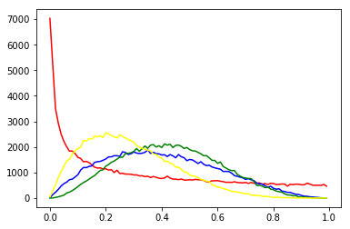
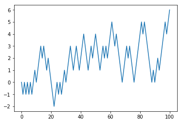

# 元素数据类型,内置数学运算和随机数

数值和随机部分是numpy的基础,这篇将学习以下3个方面

+ 内置数据类型
+ 内置数学运算
+ 随机数生成方法
    + 均匀分布
    + 正态分布


```python
import numpy as np
import matplotlib.pyplot as plt
import random
```


```python
%matplotlib inline
```

## 内置数据类型

numpy可以特化其中元素的类型来获得更高的效率


类型|类型代码|说明
---|---|---
`int8/uint8`|`i1/u1`|`有符号/无符号8位整型`
`int16/uint16`|`i2/u2`|`有符号/无符号16位整型`
`int32/uint32`|`i4/u4`|`有符号/无符号32位整型`
`int64/uint64`|`i8/u8`|`有符号/无符号64位整型`
`float16`|`f2`|`半精度浮点数`
`float32`|`f4或f`|`标准单精度浮点数`
`float64`|`f8或d`|`标准双精度浮点数`
`float128`|`f16或g`|`扩展精度浮点数`
`complex64`|`c8`|`32为浮点数表示的复数`
`complex128`|`c16`|`64为浮点数表示的复数`
`complex256`|`c32`|`128为浮点数表示的复数`
`bool`|`?`|`布尔值`
`object`|`O`|`python对象类型`
`string_`|`SX`|`固定长度字符串,比如长度为10,则S10`
`unicode_`|`UX`|`固定长度unicode,比如长度为10,则U10`


```python
np.ones((2,2),dtype="S1")
```


    array([[b'1', b'1'],
           [b'1', b'1']], 
          dtype='|S1')


## numpy内置运算函数:

函数|说明
---|---
**一元运算**|
abs/fabs|绝对值
sqrt|平方根
square|平方
exp|指数
log/log10/log2/log1p|分别为自然对数(e为底数)/底数为10的log/底数为2的log/log(1+x)
sign|求符号
ceil|大于等于该值的最小整数
floor|小于等于该值的最大整数
rint|四舍五入到最近的整数,dtype不变
modf|小数整数部分分离
isnan|---
isfinite/isinf|---
sin/sinh/cos/cosh/tan/tanh|三角函数,双曲三角函数
arcsin/arcsinh/arccos/arccosh/arctan/arctanh|反三角函数,反双曲三角函数
logical_not|计算各元素not x的真值
**二元运算**|
add|加
subtract|减
multiply|乘
divide/floor_divide|除
power|乘方
maximun/fmax|最大值
minimum/fmin|最小值
mod|求模
copysign|将后面的符号付给前面


## 随机数生成函数

numpy有自己的随机数生成器,它可以作为标准库的补充,其接口基本和标准库的一致

### 随机种子设置


```python
np.random.seed(3)
```

### 洗牌


```python
np.random.permutation([1,2,3]) # 返回一个新序列
```


    array([2, 1, 3])


```python
a=np.array([1,2,3])
np.random.shuffle(a)#就地洗牌
a
```


    array([1, 3, 2])


### 均匀分布


```python
np.random.rand() #[0,1)间均匀分布
```


    0.2909047389129443


```python
np.random.rand(2,3) #生成均匀分布的数组
```


    array([[ 0.51082761,  0.89294695,  0.89629309],
           [ 0.12558531,  0.20724288,  0.0514672 ]])


```python
np.random.uniform(2,3) # 范围[2,3)中的均匀分布
```


    2.4408098436506362


```python
np.random.uniform(2,3,size=(3,4)) # 范围[2,3)中的均匀分布的3X4数组
```


    array([[ 2.02987621,  2.45683322,  2.64914405,  2.27848728],
           [ 2.6762549 ,  2.59086282,  2.02398188,  2.55885409],
           [ 2.25925245,  2.4151012 ,  2.28352508,  2.69313792]])


```python
np.random.randint(1,9)#上下限范围[1,9)内的整数
```


    7


```python
np.random.randint(1,9,size=(3,3))#上下限范围[1,9)内的整数数组
```


    array([[8, 1, 4],
           [2, 4, 8],
           [1, 6, 5]])


```python
l=np.random.rand(1000)
```


```python
r1=[len(list(filter(lambda x:i+0.005>x>i-0.005,l))) for i in map(lambda x:round(x*0.01,3),range(0,100,1))]
```


```python
plt.plot(list(map(lambda x:round(x*0.01,3),range(0,100,1))),r1)
plt.show()
```


### 正态分布


```python
np.random.normal(1,0.5)#均值为1,标准差差是0.5
```


    1.4976562274678098


```python
np.random.normal(1,0.5,size=(3,3))#均值为1,标准差差是0.5
```


    array([[ 1.20455962,  1.62913661,  0.10931642],
           [ 1.24831185,  0.92775481,  1.43346156],
           [ 1.11850458,  0.63128245,  1.10479407]])


```python
np.random.randn(2,3)#均值为0,标准差差是1的标准正态分布的2X3数组
```


    array([[ 0.80698364, -1.66132958,  0.24282147],
           [ 0.64382288,  1.35099208, -1.24669106]])


```python
l=np.random.randn(100000)
```


```python
r1=[len(list(filter(lambda x:i+0.05>x>i-0.05,l))) for i in map(lambda x:round(x*0.1,2),range(-40,40,1))]
```


```python

plt.plot(list(map(lambda x:round(x*0.1,2),range(-40,40,1))),r1)
plt.show()
```


### \*二项分布

二项分布是n个独立的是/非试验中成功的次数的离散概率分布，其中每次试验的成功概率为p。这样的单次成功/失败试验又称为伯努利试验。实际上，当n = 1时，二项分布就是伯努利分布。二项分布是显著性差异的二项试验的基础。

Poisson分布是二项分布n很大而P很小时的特殊形式，是两分类资料在n次实验中发生x次某种结果的概率分布。其概率密度函数为：P(x)=e-µ*µx/x! x=0,1,2...n，其中e为自然对数的底，µ为总体均数，x为事件发生的阳性数。


```python
sum(np.random.binomial(10,0.1,1000)==0)/1000.0# 10个样本成功率为0.1,验证1000次全部都失败的概率
```


    0.35499999999999998


### Beta分布


```python
np.random.beta(0.5,0.3)
```


    0.3470417362539864


```python
np.random.beta(0.5,0.3,[2,3])
```


    array([[ 0.05610158,  0.29834244,  0.77032789],
           [ 0.94635763,  0.96394357,  0.02252188]])


```python
l0=np.random.beta(0.5,1,100000)
l1=np.random.beta(2,3,100000)
l2=np.random.beta(3,4,100000)
l3=np.random.beta(2,5,100000)
```


```python
r0=[len(list(filter(lambda x:i+0.005>x>i-0.005,l0))) for i in map(lambda x:round(x*0.01,3),range(0,100,1))]
r1=[len(list(filter(lambda x:i+0.005>x>i-0.005,l1))) for i in map(lambda x:round(x*0.01,3),range(0,100,1))]
r2=[len(list(filter(lambda x:i+0.005>x>i-0.005,l2))) for i in map(lambda x:round(x*0.01,3),range(0,100,1))]
r3=[len(list(filter(lambda x:i+0.005>x>i-0.005,l3))) for i in map(lambda x:round(x*0.01,3),range(0,100,1))]
```


```python
plt.plot(list(map(lambda x:round(x*0.01,3),range(0,100,1))),r0,color="red")
plt.plot(list(map(lambda x:round(x*0.01,3),range(0,100,1))),r1,color="blue")
plt.plot(list(map(lambda x:round(x*0.01,3),range(0,100,1))),r2,color="green")
plt.plot(list(map(lambda x:round(x*0.01,3),range(0,100,1))),r3,color="yellow")
plt.show()
```





```python
min(l)
```


    -4.5696665976275819


### \*卡方分布

若k个随机变量$Z_1、……、Z_k$是相互独立，符合标准正态分布的随机变量（数学期望为0、方差为1），则随机变量Z的平方和

$$X=\sum_{i=1}^k Z_i^2$$

被称为服从自由度为 k 的卡方分布，记作

   $$X\sim\chi^2(k)$$
    
   $$X\sim\chi^2_k$$


 


```python
np.random.chisquare(2,(2,3))
```


    array([[ 0.61277216,  2.27149958,  0.96366957],
           [ 2.19105947,  3.13205076,  0.37353015]])


### 伽马分布


```python
np.random.gamma(1,2)
```


    0.6135197929089496


```python
np.random.gamma(1,2,(2,3))
```


    array([[ 0.66365723,  1.2891411 ,  1.28417052],
           [ 0.77566813,  2.99185886,  2.11405567]])


```python
l0=np.random.gamma(0.5,1,100000)
l1=np.random.gamma(9,0.5,100000)
l2=np.random.gamma(7,1,100000)
```


```python
r0=[len(list(filter(lambda x:i+0.05>x>i-0.05,l0))) for i in map(lambda x:round(x*0.1,3),range(0,200,1))]
r1=[len(list(filter(lambda x:i+0.05>x>i-0.05,l1))) for i in map(lambda x:round(x*0.1,3),range(0,200,1))]
r2=[len(list(filter(lambda x:i+0.05>x>i-0.05,l2))) for i in map(lambda x:round(x*0.1,3),range(0,200,1))]
```


```python
plt.plot(list(map(lambda x:round(x*0.1,3),range(0,200,1))),r0,color="red")
plt.plot(list(map(lambda x:round(x*0.1,3),range(0,200,1))),r1,color="blue")
plt.plot(list(map(lambda x:round(x*0.1,3),range(0,200,1))),r2,color="green")
plt.show()
```


### 随机游走

定义一个100步的随机游走


```python
position = 0
walk=[position]
steps = 100
for i in range(steps):
    step = 1 if random.randint(0,1) else -1
    position += step
    walk.append(position)
    
plt.plot(range(steps+1),walk)
plt.show()    
```




