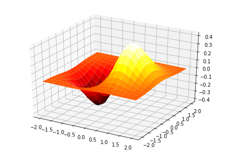

# 高性能数组narray及其universaal function

[numpy](https://docs.scipy.org/doc/numpy-dev/reference)最重要的特点就是其N维数组对象(narray)

narray是同构数组,也就是说它只能存储相同类型的数据,由于它是由C写的数据类型因此具有非常强的性能


narray实现了`Collection`,` Container`和`Iterable`协议.因此通用的序列操作都可以使用.


下面从一个例子来简单的了解下数组:


```python
import numpy as np
import matplotlib.pyplot as plt
import random
```


```python
%matplotlib inline
```


```python
data=np.array([[random.random() for i in range(3)],[random.random() for j in range(3)]])
```


```python
data
```


    array([[ 0.44099442,  0.49826309,  0.37565053],
           [ 0.40511946,  0.58691695,  0.37871745]])


```python
data.ndim#维度
```


    2


```python
data.shape#形状2行3列
```


    (2, 3)


```python
data.dtype#元素数据类型
```


    dtype('float64')


## 构建数组

numpy的数组由序列构建而来.

### 由多维序列构建多维数组


```python
np.array([[1,2,3],[4,5,6],[7,8,9]])
```


    array([[1, 2, 3],
           [4, 5, 6],
           [7, 8, 9]])


### 由一维序列构建多维数组


```python
np.array([1,2,3,4,5,6,7,8,9]).reshape(3,3)
```


    array([[1, 2, 3],
           [4, 5, 6],
           [7, 8, 9]])


## 快速构建数组

构建numpy数组除了可以从一个序列构建外,numpy还提供了很多方法快速构建一些特殊数组

### 全0数组np.zeros()


```python
np.zeros((2,2))
```


    array([[ 0.,  0.],
           [ 0.,  0.]])


```python
np.zeros_like(data)
```


    array([[ 0.,  0.,  0.],
           [ 0.,  0.,  0.]])


### 全1数组np.ones()


```python
np.ones((2,2))
```


    array([[ 1.,  1.],
           [ 1.,  1.]])


```python
np.ones_like(data)
```


    array([[ 1.,  1.,  1.],
           [ 1.,  1.,  1.]])


### 空数组(只分配内存空间不赋值,也就是说里面可能是无意义数据)np.empty()


```python
np.empty((2,2))
```


    array([[ 0.,  0.],
           [ 0.,  0.]])


```python
np.empty_like(data)
```


    array([[ 0.,  0.,  0.],
           [ 0.,  0.,  0.]])


### 等差数列np.arange(dow,up,step)


```python
np.arange(1,11,2)
```


    array([1, 3, 5, 7, 9])


### 均分范围(可以看做等差数列的一种).linspace()


```python
np.linspace(-np.pi, np.pi, 6,endpoint=True)#在pi到-pi间等分成6份
```


    array([-3.14159265, -1.88495559, -0.62831853,  0.62831853,  1.88495559,
            3.14159265])


### 等比数列.logspace()

logspace(start, stop, num=num, endpoint=endpoint,base = base)


```python
np.logspace(0.1, 1, 10)
```


    array([  1.25892541,   1.58489319,   1.99526231,   2.51188643,
             3.16227766,   3.98107171,   5.01187234,   6.30957344,
             7.94328235,  10.        ])


可以通过设置base参数来固定底,这样就相当于做乘方了


```python
np.logspace(0, 9,10,base = 2)
```


    array([   1.,    2.,    4.,    8.,   16.,   32.,   64.,  128.,  256.,  512.])


### NxN单位矩阵数组np.eye(n)


```python
np.eye(3)
```


    array([[ 1.,  0.,  0.],
           [ 0.,  1.,  0.],
           [ 0.,  0.,  1.]])


```python
np.identity(3)
```


    array([[ 1.,  0.,  0.],
           [ 0.,  1.,  0.],
           [ 0.,  0.,  1.]])


### 对角矩阵数组 .diag()


```python
np.diag((1,2,3))
```


    array([[1, 0, 0],
           [0, 2, 0],
           [0, 0, 3]])


我们也可以用对角阵数组操作提取一个数组的对角线元素


```python
org = np.arange(9).reshape(3,3)
org
```


    array([[0, 1, 2],
           [3, 4, 5],
           [6, 7, 8]])


```python
np.diag(org)
```


    array([0, 4, 8])


### 使用函数生成矩阵.fromfunction()

有的时候我们希望可以自定义的生成一个矩阵
比如我们希望生成一个各项值等于10i+j的矩阵


```python
a = np.fromfunction(lambda i,j:10*i+j,(3,4))
```


```python
a
```


    array([[  0.,   1.,   2.,   3.],
           [ 10.,  11.,  12.,  13.],
           [ 20.,  21.,  22.,  23.]])


## 数组的形状

事实上numpy的数组在物理存储上是一维的,而shape是作为属性规定其访问规则的东西.我们可以通过reshape方法调整数组的形状


#### 改变数组结构形状.reshape()


```python
np.arange(1,10)
```


    array([1, 2, 3, 4, 5, 6, 7, 8, 9])


```python
np.arange(1,10).reshape(3,3)
```


    array([[1, 2, 3],
           [4, 5, 6],
           [7, 8, 9]])


### 数组的切片与元素存取
#### 索引与切片
一维数组的索引为第一位是列
二维数组的索引为第一位是行,第二位是列,以此类推


```python
np.array([1,2,3],dtype=np.uint16)
```


    array([1, 2, 3], dtype=uint16)


```python
np.array([1,2,3],dtype=np.uint16)[:2]#一维数组
```


    array([1, 2], dtype=uint16)


```python
np.arange(1,10).reshape(3,3)
```


    array([[1, 2, 3],
           [4, 5, 6],
           [7, 8, 9]])


```python
np.arange(1,10).reshape(3,3)[1:,1:]
```


    array([[5, 6],
           [8, 9]])


#### 花式索引
花式索引是指用利用整数数组做索引提取对应行


```python
arr=np.empty((10,4))
for i in range(10):
    arr[i]=i
arr
```


    array([[ 0.,  0.,  0.,  0.],
           [ 1.,  1.,  1.,  1.],
           [ 2.,  2.,  2.,  2.],
           [ 3.,  3.,  3.,  3.],
           [ 4.,  4.,  4.,  4.],
           [ 5.,  5.,  5.,  5.],
           [ 6.,  6.,  6.,  6.],
           [ 7.,  7.,  7.,  7.],
           [ 8.,  8.,  8.,  8.],
           [ 9.,  9.,  9.,  9.]])


```python
arr[[2,4,8,6,-1]]
```


    array([[ 2.,  2.,  2.,  2.],
           [ 4.,  4.,  4.,  4.],
           [ 8.,  8.,  8.,  8.],
           [ 6.,  6.,  6.,  6.],
           [ 9.,  9.,  9.,  9.]])


```python
arr[[2,4,8,6,-1],0]
```


    array([ 2.,  4.,  8.,  6.,  9.])


#### 元素存取

只要找到对应的位置(下标拿就可以直接改变对应位置的值)


```python
A=np.arange(1,10).reshape(3,3)
A
```


    array([[1, 2, 3],
           [4, 5, 6],
           [7, 8, 9]])


```python
A[2,2]
```


    9


```python
A[2,2]=10
```


```python
A
```


    array([[ 1,  2,  3],
           [ 4,  5,  6],
           [ 7,  8, 10]])


### 结构数组

在numpy中可以定义结构数组来表现结构化数据,虽然这个功能现在有pandas这个更好的实现,但如果只是轻量级的使用,numpy的结构数组或许更有效率


```python
persontype=np.dtype({'names':['name','age','weight'],'formats':['S32','i','f']},align=True)#先创建一个人物类型
```


```python
a = np.array([("Huang",27,75),("Hao",25,55),("Li",26,80)],dtype=persontype)
```

结构数组内部看着是个元组,但其实是类似结构体的东西,使用的时候有点像用字典


```python
a[0]["name"]
```


    b'Huang'


```python
filter(lambda x: x["age"]>26,a)
```


    <filter at 0x226d0d759e8>


也可以直接获取某一列属性构成的数组


```python
a["name"]
```


    array([b'Huang', b'Hao', b'Li'], 
          dtype='|S32')


# universal function

除了通用的序列操作外,还支持`ufunc`
`ufunc`是`universal function`的简写,它是一种对数组中每个元素做相同操作的函数,概念上类似原生python的`map`,但在实际的运算中又不同.
原生map实际上是运行迭代器一个一个操作,而`universal function`则是向量化的执行函数,即一个函数不同的数据一起运行,这样就大大提高了效率.

## 内置的ufunc运算


```python
test = np.arange(int(1e5))
```


```python
%timeit -n 3 map(lambda x:x**2,test)
```

    3 loops, best of 3: 170 ns per loop
    


```python
%timeit -n 3 test**2
```

    3 loops, best of 3: 85.6 µs per loop
    

numpy内置了许多ufunc.

### 四则运算

numpy的四则运算也是ufunc,只要使用与python一样的运算符即可

为了效率,最好不要把多步写在一起


```python
np.arange(1,10).reshape(3,3)*4+2
```


    array([[ 6, 10, 14],
           [18, 22, 26],
           [30, 34, 38]])


```python
%timeit np.arange(1,10).reshape(3,3)*4+2
```

    The slowest run took 13.74 times longer than the fastest. This could mean that an intermediate result is being cached.
    1000000 loops, best of 3: 1.97 µs per loop
    


```python
def a():
    A = np.arange(1,10).reshape(3,3)*4
    return A+2
```


```python
%timeit a()
```

    The slowest run took 32.74 times longer than the fastest. This could mean that an intermediate result is being cached.
    100000 loops, best of 3: 2.02 µs per loop
    


```python
(17.17-10.46)/17.17
```


    0.39079790331974373


可见分步计算效率比单步合起来计算快了近40%

### 比较运算

numpy中比较运算也是ufunc,可以看下面的例子


```python
np.arange(1,10).reshape(3,3)>5
```


    array([[False, False, False],
           [False, False,  True],
           [ True,  True,  True]], dtype=bool)


比较运算会返回其中每个值的比较结果

### 其他的内置函数

+ 排序操作如使用键序列执行间接排序的`lexsort`,和一般的排序`argsort`,`sort`
+ 求沿给定轴的元素的累积积或和的`cumprod`和`cumsum`(默认flatten后)
+ 求沿给定轴的第n个离散差分`diff`(常用在时间序列)
+ 统计方法如平均值得`average`,`mean`,` median`,方差的`var`,标准差`std`,求协方差矩阵的`cov`,两个数组间Pearson乘积矩相关系数的`corrcoef`,最值的`argmax`, `argmin`,`max`, `maximum`, `min`, `minimum`,求和的`sum`
+ 取近似值或限制取值的方法如`ceil`,`floor`, `clip`,`round`
+ 数组间的向量,矩阵操作如`cross`,`inner`,`dot`,`transpose`,`outer`,数组元素在给定轴上的乘积`prod`,沿着数组的对角线返回总和的`trace`,`vdot`,
+ 针对某个轴做向量化操作`apply_along_axis(func1d, axis, arr, *args, **kwargs)`
+ 类似`collections.counter`的`bincount`
+ 针对复数求共轭的`conj`
+ 判断元素特点的`nonzero`,`all`,`any`
+ 将函数向量化的`vectorize`,`frompyfunc`
+ 根据条件返回元素的`where`
+ 计算卷积的`convolve`等

## 自定义ufunc

有的时候自带的ufunc不能满足需要,numpy允许自定义ufunc

例:用一个分段函数描述三角波


```python
def triangle_wave(x,c,c0,hc):
    x = x - int(x)
    if x >= c: r = 0.0
    elif x < c0: r = x / c0*hc
    else: r = (c-x) / (c-c0) * hc
    return r
```


```python
x = np.linspace(0,2,1000)
y1 = np.array([triangle_wave(t,0.6,0.4,1.0) for t in x])
```


```python
triangl_ufunc1 = np.frompyfunc(triangle_wave,4,1)
```


```python
y2 = triangl_ufunc1(x,0.6,0.4,1.0)
```


```python
plt.plot(range(len(y2)),y2)
plt.show()
```


## 广播

当ufunc对两个数组进行计算时,ufunc函数会对这俩数组对应元素进行计算:


```python
np.arange(1,10).reshape(3,3)+np.arange(2,11).reshape(3,3)
```


    array([[ 3,  5,  7],
           [ 9, 11, 13],
           [15, 17, 19]])


当俩数组形状不同的时候,那就会进行广播处理

1. 让所有数组向其中维数最多的数组看齐,shape不足的部分通过在前面加1补齐
2. 输出数组的shape属性是输入数组shape属性在各轴上的最大值
3. 如果输入数组的某个轴长度是1或输出数组对应数组对应轴的长度相同,这个数组就够用来计算,否则出错
4. 当输入数组的某个轴长度为1时,沿着该轴运算时都用此轴上的额第一组值

看例子


```python
a = np.arange(0,60,10).reshape(-1,1)
a
```


    array([[ 0],
           [10],
           [20],
           [30],
           [40],
           [50]])


```python
a.shape
```


    (6, 1)


```python
b = np.arange(0,5)
b
```


    array([0, 1, 2, 3, 4])


```python
b.shape
```


    (5,)


```python
c = a+b
```


```python
c
```


    array([[ 0,  1,  2,  3,  4],
           [10, 11, 12, 13, 14],
           [20, 21, 22, 23, 24],
           [30, 31, 32, 33, 34],
           [40, 41, 42, 43, 44],
           [50, 51, 52, 53, 54]])


```python
c.shape
```


    (6, 5)


a和b维数不同,所以根据规则1,让b的shape属性向a对齐,将b前加1,及b.shape=1,5

之后再计算

### 快速产生能进行广播的数组ogrid()


```python
x,y = np.ogrid[:5,:5]
```


```python
x
```


    array([[0],
           [1],
           [2],
           [3],
           [4]])


```python
y
```


    array([[0, 1, 2, 3, 4]])


利用ogrid的返回值可以很容易的计算出二元函数在等间距网格上的值

例:画出
$$f(x,y)=xe^{x^2-y^2}$$


```python
x,y = np.ogrid[-2:2:20j,-2:2:20j]
```


```python
x
```


    array([[-2.        ],
           [-1.78947368],
           [-1.57894737],
           [-1.36842105],
           [-1.15789474],
           [-0.94736842],
           [-0.73684211],
           [-0.52631579],
           [-0.31578947],
           [-0.10526316],
           [ 0.10526316],
           [ 0.31578947],
           [ 0.52631579],
           [ 0.73684211],
           [ 0.94736842],
           [ 1.15789474],
           [ 1.36842105],
           [ 1.57894737],
           [ 1.78947368],
           [ 2.        ]])


```python
y
```


    array([[-2.        , -1.78947368, -1.57894737, -1.36842105, -1.15789474,
            -0.94736842, -0.73684211, -0.52631579, -0.31578947, -0.10526316,
             0.10526316,  0.31578947,  0.52631579,  0.73684211,  0.94736842,
             1.15789474,  1.36842105,  1.57894737,  1.78947368,  2.        ]])


```python
z = x*np.exp(-x**2-y**2)
```


```python
from mpl_toolkits.mplot3d import Axes3D
fig = plt.figure()
ax = Axes3D(fig)
ax.plot_surface(x, y, z, rstride=1, cstride=1, cmap='hot')

plt.show()

```





## 针对ufunc的函数

针对ufunc本身还有一些方法,这些是针对两个输入一个输出的unfunc对象.

### reduce

reduce和原生python中的reduce差不多,就是rfold,折叠操作的特化


```python
np.add.reduce([1,2,3])
```


    6


```python
np.subtract.reduce([1,2,3])
```


    -4


```python
np.add.reduce([[1,2,3],[6,7,8]],axis=1)
```


    array([ 6, 21])


```python
np.add.reduce([[1,2,3],[6,7,8]],axis=0)
```


    array([ 7,  9, 11])


### accumulate

 accumulate和python3中functiontools新增的累积函数accumulate一样


```python
np.add.accumulate([1,2,3])
```


    array([1, 3, 6], dtype=int32)


```python
np.subtract.accumulate([1,2,3])
```


    array([ 1, -1, -4], dtype=int32)


### outer

outer,会对俩数组中每两对元素组合进行运算.


```python
np.multiply.outer([1,2,3,4,5],[2,3,4])
```


    array([[ 2,  3,  4],
           [ 4,  6,  8],
           [ 6,  9, 12],
           [ 8, 12, 16],
           [10, 15, 20]])


```python
np.add.outer([1,2,3,4,5],[2,3,4])
```


    array([[3, 4, 5],
           [4, 5, 6],
           [5, 6, 7],
           [6, 7, 8],
           [7, 8, 9]])


## 数组对象操作是不是copy

+ numpy的数组在进行简单任务时,比如赋值,比如变化shape等时不是copy,参与python的function运算作为参数时也不是copy,

+ 使用numpy数组对象的`view()`方法可以获得原对象的一个浅拷贝(新的指针指向原数据),而切片操作也是如此,它也是浅拷贝

+ numpy数组对象的copy()可以获得一份原数据的深拷贝
