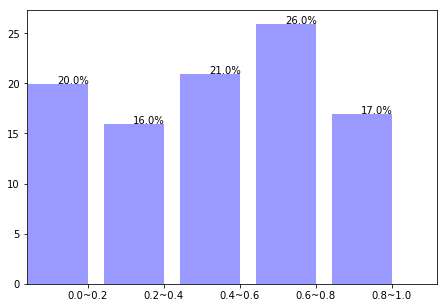
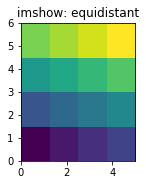

# 用numpy做简单的统计

numpy有方便的数组,因此统计分析也是其很重要的一个功能

## 基本统计运算

**统计运算**|说明
---|---
sum|统计求和
mean|均值
average|加权求均值
median|中值
std|标准差
var|方差
min|最小值
argmin|最小值下标
max|最大值
argmax|最大值下标
ptp|最大值和最小值之差
sort|排序
argsort|排序下标
unique|找出所有整数(不会出现重复),并排序,</br>可选参数return_index=True,会额外返回一个记录下标的数组</br>可选return_inverse=True,会额外返回一个下标数组,数组长度为原始数组,表示原始数组中对应的下标
bincount|对整数数组个元素出现次数统计,可选参数weight,可以对各个元素加权


其中很多运算还有个`nanxxx`版本,用来求相应函数去掉nan值得结果


```python
import numpy as np
import matplotlib.pyplot as plt
import random
```


```python
%matplotlib inline
```

## 统计频数bincount


```python
a = np.random.randint(0,5,10)
```


```python
a
```


    array([3, 3, 4, 1, 0, 1, 2, 4, 4, 2])


```python
np.bincount(a)
```


    array([1, 2, 2, 2, 3], dtype=int64)


```python
len(filter(lambda x : x == 0,a))
```


    ---------------------------------------------------------------------------

    TypeError                                 Traceback (most recent call last)

    <ipython-input-6-fb1e20a08aa3> in <module>()
    ----> 1 len(filter(lambda x : x == 0,a))
    

    TypeError: object of type 'filter' has no len()


```python
np.bincount(a,np.random.rand(10))
```


    array([ 0.19711768,  1.18850072,  1.80437954,  0.94394277,  1.34664336])


## 卷积

卷积运算符经常出现在信号处理中，其中它模拟线性时不变系统对信号的影响。在概率理论中，两个独立随机变量的和根据它们各自的分布的卷积来分布。
离散卷积运算定义为:

$$ (a * v)[n] = \sum_{m = -\infty}^{\infty} a[m] v[n - m] $$

可以看出，在适当的填充（需要填充以防止循环卷积）之后，时间/空间中的卷积等价于傅立叶域中的乘法。由于乘法比卷积更有效（更快），函数scipy.signal.fftconvolve可以利用FFT来计算大数据集的卷积

numpy提供了通用的卷积操作`convolve(a, v, mode='full')`
其中前两个参数都是一维的输入向量,而mode则提供了可选的三种运算规则,它可以有3种选项

+ full
    默认情况下，模式为“full”。这在每个重叠点处返回卷积，其输出形状为(N M-1,).在卷积的端点，信号不完全重叠，并且可以看到边界效应。
    
+ same
    模式same返回长度max（M，N）的输出。边界效应仍然可见。
    
+ valid
    模式'valid'返回长度为max(M,N)-min(M,N)+1.卷积产物仅针对信号完全重叠的点给出。信号边界外的值没有效果。


```python
np.convolve([1, 2, 3], [0, 1, 0.5])
```


    array([ 0. ,  1. ,  2.5,  4. ,  1.5])


```python
np.convolve([1,2,3],[0,1,0.5], 'same')
```


    array([ 1. ,  2.5,  4. ])


```python
np.convolve([1,2,3],[0,1,0.5], 'valid')
```


    array([ 2.5])


## 相关性

numpy提供了3种算相关性的操作

+ ### corrcoef(x, y=None, rowvar=1) Pearson乘积矩相关系数。

其中rowvar=1表示向量是横置的,即每一列为向量的一个属性,每行是一个向量.为0则说明向量为竖置


```python
np.corrcoef([[1,1,0,1,1],[0,1,0,1,1]])
```


    array([[ 1.        ,  0.61237244],
           [ 0.61237244,  1.        ]])


```python
np.corrcoef([[1,1,0,1,1],[0,1,0,1,1]],rowvar=0)
```

    C:\Users\Administrator\Anaconda3\lib\site-packages\numpy\lib\function_base.py:2569: RuntimeWarning: invalid value encountered in true_divide
      c /= stddev[:, None]
    C:\Users\Administrator\Anaconda3\lib\site-packages\numpy\lib\function_base.py:2570: RuntimeWarning: invalid value encountered in true_divide
      c /= stddev[None, :]
    


    array([[  1.,  nan,  nan,  nan,  nan],
           [ nan,  nan,  nan,  nan,  nan],
           [ nan,  nan,  nan,  nan,  nan],
           [ nan,  nan,  nan,  nan,  nan],
           [ nan,  nan,  nan,  nan,  nan]])


+ ### correlate(a, v, mode='valid')[source]两个1维序列的互相关。该函数计算信号处理文本中通常定义的相关性

$ c_{av}[k] = sum_n a[n+k] * conj(v[n]) $

其中a和v序列在必要时被填零，conj是共轭。mode 可选{‘valid’, ‘same’, ‘full’}


```python
np.correlate([1, 2, 3], [0, 1, 0.5])
```


    array([ 3.5])


```python
np.correlate([1, 2, 3], [0, 1, 0.5], "same")
```


    array([ 2. ,  3.5,  3. ])


```python
np.correlate([1, 2, 3], [0, 1, 0.5], "full")
```


    array([ 0.5,  2. ,  3.5,  3. ,  0. ])


+ ### cov(m, y=None, rowvar=True, bias=False, ddof=None, fweights=None, aweights=None)估计协方差矩阵，给定数据和权重。
    协方差表示两个变量一起变化的水平。
    如果我们检查N维样本，则协方差矩阵元素$C_{ij}$是$x_i$和$x_j$的协方差。$C_{ii}$元素是$x_i$的方差。
    其中rowvar一样是代表向量的是横置还是竖置
    
    
在概率论和统计学中，协方差Cov(X，Y)用于衡量两个变量的总体误差。而方差是协方差的一种特殊情况，即当两个变量是相同的情况。

期望值分别为$E(X)=\mu$与$E(Y)=\nu$的两个实数随机变量X 与Y 之间的协方差定义为：


$\operatorname{cov}(X, Y) = \operatorname{E}((X - \mu) (Y - \nu))$

$\operatorname{cov}(X, Y) = \operatorname{E}(X \cdot Y) - \mu \nu$

协方差矩阵是一个矩阵，其每个元素是各个向量元素之间的协方差。是从标量随机变量到高维度随机向量的自然推广。


```python
persontype=np.dtype({'names':['name','height','weight'],'formats':['S32','f','f']},align=True)#先创建一个人物类型
```


```python
a = np.array([("Huang",175,70),("Hao",170,60),("Li",180,75)],dtype=persontype)
```


```python
data = np.array([a["height"],a["weight"]])
data
```


    array([[ 175.,  170.,  180.],
           [  70.,   60.,   75.]], dtype=float32)


```python
data_cov = np.cov(data)
data_cov #协方差矩阵
```


    array([[ 25.        ,  37.5       ],
           [ 37.5       ,  58.33333333]])


```python
#相关系数矩阵
data_corr = np.corrcoef(data)
data_corr 
```


    array([[ 1.        ,  0.98198051],
           [ 0.98198051,  1.        ]])


也就是说身高与体重相关系数高达98.19%

## 直方图

+ ### 直方图统计histogram

最基础的直方图,计算一组数据各个区间中的数据统计

用法:

histogram(a,bins=10,range=None,normed=False,weights=None)

其中

+ bin指定统计区间个数,

+ range是一个长为2的元组,分别表示统计范围的最小值和最大值(None表示由数据决定)

+ normed=False表示返回在每个区间的个数,为True则表示返回一个在各个区间的概率密度

+ weight表示权值和前面一样用法


```python
c = np.random.rand(100)
```


```python
y,x = np.histogram(c,bins=5,range=(0,1))
```


```python
x
```


    array([ 0. ,  0.2,  0.4,  0.6,  0.8,  1. ])


```python
float(y[0])/sum(y)
```


    0.20000000000000001


```python
xticks = [str(x[i])+'~'+str(x[i+1]) for i in range(len(y)) ]
```


```python
xticks
```


    ['0.0~0.2', '0.2~0.4', '0.4~0.6', '0.6~0.8', '0.8~1.0']


```python
plt.axes([0.025,0.025,0.95,0.95])
plt.bar(range(len(y)), y, facecolor='#9999ff', edgecolor='white')
for i,j in zip(range(len(y)), y):
    plt.text(i,j,str(float(y[i])/sum(y)*100)+"%")

plt.xlim(-0.4,5)
plt.xticks(np.arange(5)+0.4,xticks)
plt.show()
```





+ ### histogram2d(x, y[, bins, range, normed, weights])计算两个数据样本的二维直方图。


```python
xedges = [0, 1, 1.5, 3, 5]
```


```python
yedges = [0, 2, 3, 4, 6]
```


```python
x = np.random.normal(3, 1, 100)
y = np.random.normal(1, 1, 100)
H, xedges, yedges = np.histogram2d(y, x, bins=(xedges, yedges))
```


```python
H = np.ones((4, 4)).cumsum().reshape(4, 4)
```


```python
print(H[::-1]) 
```

    [[ 13.  14.  15.  16.]
     [  9.  10.  11.  12.]
     [  5.   6.   7.   8.]
     [  1.   2.   3.   4.]]
    


```python
fig = plt.figure(figsize=(7, 3))
ax = fig.add_subplot(131)
ax.set_title('imshow: equidistant')
im = plt.imshow(H, interpolation='nearest', origin='low',
            extent=[xedges[0], xedges[-1], yedges[0], yedges[-1]])
```





+ ### histogramdd(sample, bins=10, range=None, normed=False, weights=None)计算多维直方图


```python
r = np.random.randn(100,3)
H, edges = np.histogramdd(r, bins = (5, 8, 4))
H.shape, edges[0].size, edges[1].size, edges[2].size
```


    ((5, 8, 4), 6, 9, 5)


+ ### digitize(x, bins, right=False)返回输入数组中每个值所属的bin的索引


```python
x = np.array([0.2, 6.4, 3.0, 1.6])
bins = np.array([0.0, 1.0, 2.5, 4.0, 10.0])
inds = np.digitize(x, bins)
inds
```


    array([1, 4, 3, 2], dtype=int64)


```python
for n in range(x.size):
    print(bins[inds[n]-1], "<=", x[n], "<", bins[inds[n]])
```

    0.0 <= 0.2 < 1.0
    4.0 <= 6.4 < 10.0
    2.5 <= 3.0 < 4.0
    1.0 <= 1.6 < 2.5
    


```python
x = np.array([1.2, 10.0, 12.4, 15.5, 20.])
bins = np.array([0, 5, 10, 15, 20])
np.digitize(x,bins,right=True)
```


    array([1, 2, 3, 4, 4], dtype=int64)


```python
np.digitize(x,bins,right=False)

```


    array([1, 3, 3, 4, 5], dtype=int64)


