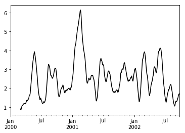
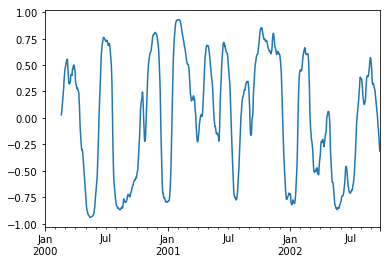

# 统计分析

pandas本身定位是表格工具,算法不是他的主要目标,所以他内置的算法只是坎坎够用,pandas本身依赖numpy,因此numpy有的统计方法他都有,比如观察他的均值方差标准差什么的,本文依然使用iris来作为源数据


```python
import pandas as pd
import matplotlib.pyplot as plt
```


```python
%matplotlib inline
```


```python
iris_data = pd.read_csv("./source/iris.data",header = None,encoding = "utf-8",
                        names=["sepal_length","sepal_width","petal_length","petal_width","class"])
```


```python
iris_data.describe()
```


<div>
<table border="1" class="dataframe">
  <thead>
    <tr style="text-align: right;">
      <th></th>
      <th>sepal_length</th>
      <th>sepal_width</th>
      <th>petal_length</th>
      <th>petal_width</th>
    </tr>
  </thead>
  <tbody>
    <tr>
      <th>count</th>
      <td>150.000000</td>
      <td>150.000000</td>
      <td>150.000000</td>
      <td>150.000000</td>
    </tr>
    <tr>
      <th>mean</th>
      <td>5.843333</td>
      <td>3.054000</td>
      <td>3.758667</td>
      <td>1.198667</td>
    </tr>
    <tr>
      <th>std</th>
      <td>0.828066</td>
      <td>0.433594</td>
      <td>1.764420</td>
      <td>0.763161</td>
    </tr>
    <tr>
      <th>min</th>
      <td>4.300000</td>
      <td>2.000000</td>
      <td>1.000000</td>
      <td>0.100000</td>
    </tr>
    <tr>
      <th>25%</th>
      <td>5.100000</td>
      <td>2.800000</td>
      <td>1.600000</td>
      <td>0.300000</td>
    </tr>
    <tr>
      <th>50%</th>
      <td>5.800000</td>
      <td>3.000000</td>
      <td>4.350000</td>
      <td>1.300000</td>
    </tr>
    <tr>
      <th>75%</th>
      <td>6.400000</td>
      <td>3.300000</td>
      <td>5.100000</td>
      <td>1.800000</td>
    </tr>
    <tr>
      <th>max</th>
      <td>7.900000</td>
      <td>4.400000</td>
      <td>6.900000</td>
      <td>2.500000</td>
    </tr>
  </tbody>
</table>
</div>


可以看到各个列的最常见统计学指标

## 相关性

numpy只默认支持协方差矩阵的计算

他们都可以带参数min_periods关键字，该关键字为每个列对指定所需的最小观测值数，以获得有效的结果

+ 协方差矩阵


```python
iris_copy = iris_data.copy()
```


```python
iris_cov = iris_copy[iris_copy.columns[:-1]].T.cov()
```


```python
iris_cov[:5]
```


<div>
<table border="1" class="dataframe">
  <thead>
    <tr style="text-align: right;">
      <th></th>
      <th>0</th>
      <th>1</th>
      <th>2</th>
      <th>3</th>
      <th>4</th>
      <th>5</th>
      <th>6</th>
      <th>7</th>
      <th>8</th>
      <th>9</th>
      <th>...</th>
      <th>140</th>
      <th>141</th>
      <th>142</th>
      <th>143</th>
      <th>144</th>
      <th>145</th>
      <th>146</th>
      <th>147</th>
      <th>148</th>
      <th>149</th>
    </tr>
  </thead>
  <tbody>
    <tr>
      <th>0</th>
      <td>4.750000</td>
      <td>4.421667</td>
      <td>4.353333</td>
      <td>4.160000</td>
      <td>4.696667</td>
      <td>4.860000</td>
      <td>4.215000</td>
      <td>4.595000</td>
      <td>3.9650</td>
      <td>4.493333</td>
      <td>...</td>
      <td>2.650000</td>
      <td>3.090000</td>
      <td>2.341667</td>
      <td>2.730</td>
      <td>2.596667</td>
      <td>2.850000</td>
      <td>2.741667</td>
      <td>2.915000</td>
      <td>2.475000</td>
      <td>2.600000</td>
    </tr>
    <tr>
      <th>1</th>
      <td>4.421667</td>
      <td>4.149167</td>
      <td>4.055000</td>
      <td>3.885000</td>
      <td>4.358333</td>
      <td>4.515000</td>
      <td>3.907500</td>
      <td>4.284167</td>
      <td>3.7075</td>
      <td>4.210000</td>
      <td>...</td>
      <td>2.725000</td>
      <td>3.128333</td>
      <td>2.409167</td>
      <td>2.805</td>
      <td>2.661667</td>
      <td>2.906667</td>
      <td>2.820833</td>
      <td>2.955833</td>
      <td>2.504167</td>
      <td>2.628333</td>
    </tr>
    <tr>
      <th>2</th>
      <td>4.353333</td>
      <td>4.055000</td>
      <td>3.990000</td>
      <td>3.813333</td>
      <td>4.303333</td>
      <td>4.453333</td>
      <td>3.861667</td>
      <td>4.211667</td>
      <td>3.6350</td>
      <td>4.120000</td>
      <td>...</td>
      <td>2.446667</td>
      <td>2.850000</td>
      <td>2.161667</td>
      <td>2.520</td>
      <td>2.396667</td>
      <td>2.630000</td>
      <td>2.531667</td>
      <td>2.688333</td>
      <td>2.281667</td>
      <td>2.396667</td>
    </tr>
    <tr>
      <th>3</th>
      <td>4.160000</td>
      <td>3.885000</td>
      <td>3.813333</td>
      <td>3.656667</td>
      <td>4.110000</td>
      <td>4.256667</td>
      <td>3.688333</td>
      <td>4.031667</td>
      <td>3.4850</td>
      <td>3.953333</td>
      <td>...</td>
      <td>2.493333</td>
      <td>2.856667</td>
      <td>2.218333</td>
      <td>2.580</td>
      <td>2.443333</td>
      <td>2.653333</td>
      <td>2.571667</td>
      <td>2.718333</td>
      <td>2.321667</td>
      <td>2.440000</td>
    </tr>
    <tr>
      <th>4</th>
      <td>4.696667</td>
      <td>4.358333</td>
      <td>4.303333</td>
      <td>4.110000</td>
      <td>4.650000</td>
      <td>4.810000</td>
      <td>4.175000</td>
      <td>4.541667</td>
      <td>3.9150</td>
      <td>4.433333</td>
      <td>...</td>
      <td>2.530000</td>
      <td>2.963333</td>
      <td>2.238333</td>
      <td>2.610</td>
      <td>2.483333</td>
      <td>2.726667</td>
      <td>2.615000</td>
      <td>2.798333</td>
      <td>2.381667</td>
      <td>2.503333</td>
    </tr>
  </tbody>
</table>
<p>5 rows × 150 columns</p>
</div>


+ 皮尔逊相关度

    这个可以使用numpy来求了


```python
import numpy as np
```


```python
iris_copy = iris_data.copy()
iris_ = iris_copy[iris_copy.columns[:-1]]
```


```python
pd.DataFrame(np.corrcoef(iris_.as_matrix()))[:5]
```


<div>
<table border="1" class="dataframe">
  <thead>
    <tr style="text-align: right;">
      <th></th>
      <th>0</th>
      <th>1</th>
      <th>2</th>
      <th>3</th>
      <th>4</th>
      <th>5</th>
      <th>6</th>
      <th>7</th>
      <th>8</th>
      <th>9</th>
      <th>...</th>
      <th>140</th>
      <th>141</th>
      <th>142</th>
      <th>143</th>
      <th>144</th>
      <th>145</th>
      <th>146</th>
      <th>147</th>
      <th>148</th>
      <th>149</th>
    </tr>
  </thead>
  <tbody>
    <tr>
      <th>0</th>
      <td>1.000000</td>
      <td>0.995999</td>
      <td>0.999974</td>
      <td>0.998168</td>
      <td>0.999347</td>
      <td>0.999586</td>
      <td>0.998811</td>
      <td>0.999538</td>
      <td>0.998077</td>
      <td>0.996552</td>
      <td>...</td>
      <td>0.597825</td>
      <td>0.685581</td>
      <td>0.574649</td>
      <td>0.584668</td>
      <td>0.603048</td>
      <td>0.646865</td>
      <td>0.605998</td>
      <td>0.653473</td>
      <td>0.633917</td>
      <td>0.633158</td>
    </tr>
    <tr>
      <th>1</th>
      <td>0.995999</td>
      <td>1.000000</td>
      <td>0.996607</td>
      <td>0.997397</td>
      <td>0.992233</td>
      <td>0.993592</td>
      <td>0.990721</td>
      <td>0.997118</td>
      <td>0.998546</td>
      <td>0.999033</td>
      <td>...</td>
      <td>0.657750</td>
      <td>0.742643</td>
      <td>0.632574</td>
      <td>0.642756</td>
      <td>0.661387</td>
      <td>0.705879</td>
      <td>0.667114</td>
      <td>0.708983</td>
      <td>0.686257</td>
      <td>0.684835</td>
    </tr>
    <tr>
      <th>2</th>
      <td>0.999974</td>
      <td>0.996607</td>
      <td>1.000000</td>
      <td>0.998333</td>
      <td>0.999061</td>
      <td>0.999377</td>
      <td>0.998438</td>
      <td>0.999605</td>
      <td>0.998356</td>
      <td>0.996986</td>
      <td>...</td>
      <td>0.602231</td>
      <td>0.689931</td>
      <td>0.578798</td>
      <td>0.588854</td>
      <td>0.607300</td>
      <td>0.651305</td>
      <td>0.610553</td>
      <td>0.657556</td>
      <td>0.637631</td>
      <td>0.636806</td>
    </tr>
    <tr>
      <th>3</th>
      <td>0.998168</td>
      <td>0.997397</td>
      <td>0.998333</td>
      <td>1.000000</td>
      <td>0.996719</td>
      <td>0.997833</td>
      <td>0.996139</td>
      <td>0.999546</td>
      <td>0.999833</td>
      <td>0.999307</td>
      <td>...</td>
      <td>0.641080</td>
      <td>0.722377</td>
      <td>0.620453</td>
      <td>0.629754</td>
      <td>0.646729</td>
      <td>0.686380</td>
      <td>0.647851</td>
      <td>0.694538</td>
      <td>0.677737</td>
      <td>0.677225</td>
    </tr>
    <tr>
      <th>4</th>
      <td>0.999347</td>
      <td>0.992233</td>
      <td>0.999061</td>
      <td>0.996719</td>
      <td>1.000000</td>
      <td>0.999883</td>
      <td>0.999914</td>
      <td>0.998503</td>
      <td>0.996031</td>
      <td>0.993761</td>
      <td>...</td>
      <td>0.576858</td>
      <td>0.664510</td>
      <td>0.555166</td>
      <td>0.564947</td>
      <td>0.582896</td>
      <td>0.625491</td>
      <td>0.584183</td>
      <td>0.634029</td>
      <td>0.616536</td>
      <td>0.616138</td>
    </tr>
  </tbody>
</table>
<p>5 rows × 150 columns</p>
</div>


也可以使用pandas中的corr方法

corr可以使用的算法有:

+ pearson

    (default)皮尔逊相关系数
    
+ kendall

    Kendall Tau相关系数
    
+ spearman

    斯皮尔曼等级相关系数

可以使用'method'关键字指定.请注意，非数字列将从相关性计算中自动排除。为了自己看起来明确,要么写好注释,要么就自己手动排除或者处理


```python
iris_T.corr(method='spearman')[:5]
```


    ---------------------------------------------------------------------------

    NameError                                 Traceback (most recent call last)

    <ipython-input-11-80af32bdcf9b> in <module>()
    ----> 1 iris_T.corr(method='spearman')[:5]
    

    NameError: name 'iris_T' is not defined


## 其他统计方法


Method|Description
---|---
count()|Number of non-null observations
sum()|Sum of values
mean()|Mean of values
median()|Arithmetic median of values
min()|Minimum
max()|Maximum
std()|Bessel-corrected sample standard deviation
var()|Unbiased variance
skew()|偏度
kurt()|峰度
quantile()|分位数(百分比作为值参数)
apply()|Generic apply

## 窗口函数

对于处理数据，pandas提供了许多窗口函数用于计算公共窗口或滚动统计。
其中包括计数，总和，平均值，中值，相关性，方差，协方差，标准偏差，偏度和峰度。

我们使用`rolling`,`.expanding `,`ewm` 对数据进行相应的处理

这三个函数的用法和groupby很像,
他们的构造函数通常这些方法都有相同的接口。
他们都接受以下参数：

+ window：移动窗口的大小
+ min_periods：要求非空数据点的阈值（否则结果为NA）
+ center：boolean，是否在中间设置标签（默认为False）
+ axis

+ ### rolling函数

`rolling(window,min_periods,center,axis)`


```python
s = pd.Series(np.random.randn(1000), index=pd.date_range('1/1/2000', periods=1000))
s = s.cumsum()
s[:5]
```


    2000-01-01   -1.469066
    2000-01-02   -1.493505
    2000-01-03   -3.071202
    2000-01-04   -2.740711
    2000-01-05   -3.336262
    Freq: D, dtype: float64


```python
r = s.rolling(window=60)
```


```python
r
```


    Rolling [window=60,center=False,axis=0]


```python
r.mean()
```


    2000-01-01          NaN
    2000-01-02          NaN
    2000-01-03          NaN
    2000-01-04          NaN
    2000-01-05          NaN
    2000-01-06          NaN
    2000-01-07          NaN
    2000-01-08          NaN
    2000-01-09          NaN
    2000-01-10          NaN
    2000-01-11          NaN
    2000-01-12          NaN
    2000-01-13          NaN
    2000-01-14          NaN
    2000-01-15          NaN
    2000-01-16          NaN
    2000-01-17          NaN
    2000-01-18          NaN
    2000-01-19          NaN
    2000-01-20          NaN
    2000-01-21          NaN
    2000-01-22          NaN
    2000-01-23          NaN
    2000-01-24          NaN
    2000-01-25          NaN
    2000-01-26          NaN
    2000-01-27          NaN
    2000-01-28          NaN
    2000-01-29          NaN
    2000-01-30          NaN
                    ...    
    2002-08-28    46.641130
    2002-08-29    46.733553
    2002-08-30    46.801611
    2002-08-31    46.899215
    2002-09-01    47.016365
    2002-09-02    47.088110
    2002-09-03    47.147598
    2002-09-04    47.200116
    2002-09-05    47.257776
    2002-09-06    47.335399
    2002-09-07    47.402138
    2002-09-08    47.416653
    2002-09-09    47.402354
    2002-09-10    47.377841
    2002-09-11    47.358784
    2002-09-12    47.339613
    2002-09-13    47.287782
    2002-09-14    47.239256
    2002-09-15    47.219807
    2002-09-16    47.201183
    2002-09-17    47.142999
    2002-09-18    47.060706
    2002-09-19    47.029424
    2002-09-20    46.995019
    2002-09-21    46.961195
    2002-09-22    46.952758
    2002-09-23    46.961190
    2002-09-24    46.940297
    2002-09-25    46.935238
    2002-09-26    46.923563
    Freq: D, dtype: float64


```python
s.plot()
r.mean().plot(style='k')
```


    <matplotlib.axes._subplots.AxesSubplot at 0x14687701898>


```python
df = pd.DataFrame(np.random.randn(1000, 4),
                  index=pd.date_range('1/1/2000', periods=1000),
                  columns=['A', 'B', 'C', 'D'])

df = df.cumsum()
df.rolling(window=60).sum().plot(subplots=True)
df.plot(subplots=True)
```


    array([<matplotlib.axes._subplots.AxesSubplot object at 0x0000014687BE3860>,
           <matplotlib.axes._subplots.AxesSubplot object at 0x0000014687B19780>,
           <matplotlib.axes._subplots.AxesSubplot object at 0x0000014687C86208>,
           <matplotlib.axes._subplots.AxesSubplot object at 0x0000014687CEC518>], dtype=object)


#### 使用自定义的方法 


```python
s.rolling(window=60)\
.apply(lambda x: np.fabs(x - x.mean()).mean())\
.plot(style='k')

```


    <matplotlib.axes._subplots.AxesSubplot at 0x14687fc5278>





rolling有一个特有关键字win_type
它表示窗口的类型,
公认类型有:
+ boxcar
+ triang
+ blackman
+ hamming
+ bartlett
+ parzen
+ bohman
+ blackmanharris
+ nuttall
+ barthann
+ kaiser (需要beta参数)
+ gaussian (需要std参数)
+ general_gaussian (需要 power, width参数)
+ slepian (需要width参数).


```python
ser = pd.Series(np.random.randn(10), index=pd.date_range('1/1/2000', periods=10))
ser.rolling(window=5, win_type='triang').mean()
```


    2000-01-01         NaN
    2000-01-02         NaN
    2000-01-03         NaN
    2000-01-04         NaN
    2000-01-05    0.241423
    2000-01-06    0.554305
    2000-01-07    0.879226
    2000-01-08    0.802116
    2000-01-09    0.600150
    2000-01-10    0.049508
    Freq: D, dtype: float64


```python
ser.rolling(window=5, win_type='boxcar').mean()
```


    2000-01-01         NaN
    2000-01-02         NaN
    2000-01-03         NaN
    2000-01-04         NaN
    2000-01-05    0.430083
    2000-01-06    0.543986
    2000-01-07    0.612879
    2000-01-08    0.790742
    2000-01-09    0.600822
    2000-01-10   -0.150064
    Freq: D, dtype: float64


```python
ser.rolling(window=5, win_type='gaussian').mean(std=0.1)
```


    2000-01-01         NaN
    2000-01-02         NaN
    2000-01-03         NaN
    2000-01-04         NaN
    2000-01-05   -0.345494
    2000-01-06    0.117715
    2000-01-07    2.378884
    2000-01-08   -0.026842
    2000-01-09    0.940132
    2000-01-10    0.543824
    Freq: D, dtype: float64


### 时间感知滚动

这对于非规则的时间频率指数特别有用。第一个参数使用字符串表示时间间隔即可


```python
dft = pd.DataFrame({'B': [0, 1, 2, np.nan, 4]},
                   index=pd.date_range('20130101 09:00:00', periods=5, freq='s'))
dft
```


<div>
<table border="1" class="dataframe">
  <thead>
    <tr style="text-align: right;">
      <th></th>
      <th>B</th>
    </tr>
  </thead>
  <tbody>
    <tr>
      <th>2013-01-01 09:00:00</th>
      <td>0.0</td>
    </tr>
    <tr>
      <th>2013-01-01 09:00:01</th>
      <td>1.0</td>
    </tr>
    <tr>
      <th>2013-01-01 09:00:02</th>
      <td>2.0</td>
    </tr>
    <tr>
      <th>2013-01-01 09:00:03</th>
      <td>NaN</td>
    </tr>
    <tr>
      <th>2013-01-01 09:00:04</th>
      <td>4.0</td>
    </tr>
  </tbody>
</table>
</div>


```python
dft.rolling('2s').sum()
```


<div>
<table border="1" class="dataframe">
  <thead>
    <tr style="text-align: right;">
      <th></th>
      <th>B</th>
    </tr>
  </thead>
  <tbody>
    <tr>
      <th>2013-01-01 09:00:00</th>
      <td>0.0</td>
    </tr>
    <tr>
      <th>2013-01-01 09:00:01</th>
      <td>1.0</td>
    </tr>
    <tr>
      <th>2013-01-01 09:00:02</th>
      <td>3.0</td>
    </tr>
    <tr>
      <th>2013-01-01 09:00:03</th>
      <td>2.0</td>
    </tr>
    <tr>
      <th>2013-01-01 09:00:04</th>
      <td>4.0</td>
    </tr>
  </tbody>
</table>
</div>


### 计算窗口的cov() 和 corr() 

在金融数据分析和其他领域中，通常对于时间序列的集合计算协方差和相关矩阵。通常，人们也对移动窗协方差和相关矩阵感兴趣。这可以通过传递 pairwise 关键字参数来实现，在DataFrame输入的情况下，将产生一个Panel，其中的 items 是有问题的日期。在单个DataFrame参数的情况下，成对参数甚至可以省略：


```python
df2 = df[:20]
```


```python
df2.rolling(window=5).corr(df2['B'])
```


<div>
<table border="1" class="dataframe">
  <thead>
    <tr style="text-align: right;">
      <th></th>
      <th>A</th>
      <th>B</th>
      <th>C</th>
      <th>D</th>
    </tr>
  </thead>
  <tbody>
    <tr>
      <th>2000-01-01</th>
      <td>NaN</td>
      <td>NaN</td>
      <td>NaN</td>
      <td>NaN</td>
    </tr>
    <tr>
      <th>2000-01-02</th>
      <td>NaN</td>
      <td>NaN</td>
      <td>NaN</td>
      <td>NaN</td>
    </tr>
    <tr>
      <th>2000-01-03</th>
      <td>NaN</td>
      <td>NaN</td>
      <td>NaN</td>
      <td>NaN</td>
    </tr>
    <tr>
      <th>2000-01-04</th>
      <td>NaN</td>
      <td>NaN</td>
      <td>NaN</td>
      <td>NaN</td>
    </tr>
    <tr>
      <th>2000-01-05</th>
      <td>-0.988134</td>
      <td>1.0</td>
      <td>-0.509080</td>
      <td>-0.044348</td>
    </tr>
    <tr>
      <th>2000-01-06</th>
      <td>-0.971898</td>
      <td>1.0</td>
      <td>-0.267032</td>
      <td>-0.140462</td>
    </tr>
    <tr>
      <th>2000-01-07</th>
      <td>-0.614334</td>
      <td>1.0</td>
      <td>-0.248780</td>
      <td>-0.932933</td>
    </tr>
    <tr>
      <th>2000-01-08</th>
      <td>-0.164408</td>
      <td>1.0</td>
      <td>0.333629</td>
      <td>-0.705022</td>
    </tr>
    <tr>
      <th>2000-01-09</th>
      <td>0.588439</td>
      <td>1.0</td>
      <td>0.461840</td>
      <td>-0.424914</td>
    </tr>
    <tr>
      <th>2000-01-10</th>
      <td>-0.089130</td>
      <td>1.0</td>
      <td>0.613644</td>
      <td>-0.502755</td>
    </tr>
    <tr>
      <th>2000-01-11</th>
      <td>-0.404701</td>
      <td>1.0</td>
      <td>0.817422</td>
      <td>-0.617821</td>
    </tr>
    <tr>
      <th>2000-01-12</th>
      <td>-0.306358</td>
      <td>1.0</td>
      <td>0.947502</td>
      <td>-0.482659</td>
    </tr>
    <tr>
      <th>2000-01-13</th>
      <td>0.162125</td>
      <td>1.0</td>
      <td>0.722880</td>
      <td>0.765848</td>
    </tr>
    <tr>
      <th>2000-01-14</th>
      <td>0.921286</td>
      <td>1.0</td>
      <td>-0.163586</td>
      <td>0.728886</td>
    </tr>
    <tr>
      <th>2000-01-15</th>
      <td>0.936731</td>
      <td>1.0</td>
      <td>-0.898769</td>
      <td>0.799872</td>
    </tr>
    <tr>
      <th>2000-01-16</th>
      <td>0.921981</td>
      <td>1.0</td>
      <td>-0.622629</td>
      <td>0.715288</td>
    </tr>
    <tr>
      <th>2000-01-17</th>
      <td>0.852761</td>
      <td>1.0</td>
      <td>-0.510544</td>
      <td>0.748616</td>
    </tr>
    <tr>
      <th>2000-01-18</th>
      <td>0.706772</td>
      <td>1.0</td>
      <td>-0.125578</td>
      <td>0.506575</td>
    </tr>
    <tr>
      <th>2000-01-19</th>
      <td>-0.383707</td>
      <td>1.0</td>
      <td>-0.041564</td>
      <td>0.370664</td>
    </tr>
    <tr>
      <th>2000-01-20</th>
      <td>-0.740382</td>
      <td>1.0</td>
      <td>0.229220</td>
      <td>0.140201</td>
    </tr>
  </tbody>
</table>
</div>


```python
covs = df[['B','C','D']].rolling(window=50).cov(df[['A','B','C']], pairwise=True)
```


```python
covs[df.index[-50]]
```


<div>
<table border="1" class="dataframe">
  <thead>
    <tr style="text-align: right;">
      <th></th>
      <th>A</th>
      <th>B</th>
      <th>C</th>
    </tr>
  </thead>
  <tbody>
    <tr>
      <th>B</th>
      <td>-5.131780</td>
      <td>5.522610</td>
      <td>-0.344374</td>
    </tr>
    <tr>
      <th>C</th>
      <td>1.051719</td>
      <td>-0.344374</td>
      <td>2.804096</td>
    </tr>
    <tr>
      <th>D</th>
      <td>1.841796</td>
      <td>0.252558</td>
      <td>1.139038</td>
    </tr>
  </tbody>
</table>
</div>


```python
correls = df.rolling(window=50).corr()
correls[df.index[-50]]
```


<div>
<table border="1" class="dataframe">
  <thead>
    <tr style="text-align: right;">
      <th></th>
      <th>A</th>
      <th>B</th>
      <th>C</th>
      <th>D</th>
    </tr>
  </thead>
  <tbody>
    <tr>
      <th>A</th>
      <td>1.000000</td>
      <td>-0.617498</td>
      <td>0.177600</td>
      <td>0.330833</td>
    </tr>
    <tr>
      <th>B</th>
      <td>-0.617498</td>
      <td>1.000000</td>
      <td>-0.087511</td>
      <td>0.068268</td>
    </tr>
    <tr>
      <th>C</th>
      <td>0.177600</td>
      <td>-0.087511</td>
      <td>1.000000</td>
      <td>0.432085</td>
    </tr>
    <tr>
      <th>D</th>
      <td>0.330833</td>
      <td>0.068268</td>
      <td>0.432085</td>
      <td>1.000000</td>
    </tr>
  </tbody>
</table>
</div>


```python
correls.loc[:, 'A', 'C'].plot()
```


    <matplotlib.axes._subplots.AxesSubplot at 0x14689767940>





### 使用`aggregate`聚合

这个操作和groupby那个聚合非常类似,构建窗口后通过一系列算法获得了各窗口的值,我们可以通过传递一个函数到整个DataFrame

也可以用`agg()`一次应用多个function


```python
dfa = pd.DataFrame(np.random.randn(1000, 3),
                    index=pd.date_range('1/1/2000', periods=1000),
                    columns=['A', 'B', 'C'])
```


```python
r = dfa.rolling(window=60,min_periods=1)
r.aggregate(np.sum)[:10]
```


<div>
<table border="1" class="dataframe">
  <thead>
    <tr style="text-align: right;">
      <th></th>
      <th>A</th>
      <th>B</th>
      <th>C</th>
    </tr>
  </thead>
  <tbody>
    <tr>
      <th>2000-01-01</th>
      <td>-0.381921</td>
      <td>0.197892</td>
      <td>-0.387883</td>
    </tr>
    <tr>
      <th>2000-01-02</th>
      <td>-1.283849</td>
      <td>0.631795</td>
      <td>-0.984351</td>
    </tr>
    <tr>
      <th>2000-01-03</th>
      <td>-0.561875</td>
      <td>0.727460</td>
      <td>-0.631296</td>
    </tr>
    <tr>
      <th>2000-01-04</th>
      <td>-0.677190</td>
      <td>2.377584</td>
      <td>-0.764575</td>
    </tr>
    <tr>
      <th>2000-01-05</th>
      <td>-0.892768</td>
      <td>1.747055</td>
      <td>-0.672681</td>
    </tr>
    <tr>
      <th>2000-01-06</th>
      <td>-2.100031</td>
      <td>2.234710</td>
      <td>-1.314329</td>
    </tr>
    <tr>
      <th>2000-01-07</th>
      <td>-1.458504</td>
      <td>3.485393</td>
      <td>-0.673807</td>
    </tr>
    <tr>
      <th>2000-01-08</th>
      <td>-1.001579</td>
      <td>3.055856</td>
      <td>-1.339435</td>
    </tr>
    <tr>
      <th>2000-01-09</th>
      <td>-0.189259</td>
      <td>4.399352</td>
      <td>-0.788718</td>
    </tr>
    <tr>
      <th>2000-01-10</th>
      <td>0.603671</td>
      <td>4.577256</td>
      <td>-0.705698</td>
    </tr>
  </tbody>
</table>
</div>


```python
r['A'].agg([np.sum, np.mean, np.std])[:10]
```


<div>
<table border="1" class="dataframe">
  <thead>
    <tr style="text-align: right;">
      <th></th>
      <th>sum</th>
      <th>mean</th>
      <th>std</th>
    </tr>
  </thead>
  <tbody>
    <tr>
      <th>2000-01-01</th>
      <td>-0.381921</td>
      <td>-0.381921</td>
      <td>NaN</td>
    </tr>
    <tr>
      <th>2000-01-02</th>
      <td>-1.283849</td>
      <td>-0.641925</td>
      <td>0.367700</td>
    </tr>
    <tr>
      <th>2000-01-03</th>
      <td>-0.561875</td>
      <td>-0.187292</td>
      <td>0.829262</td>
    </tr>
    <tr>
      <th>2000-01-04</th>
      <td>-0.677190</td>
      <td>-0.169298</td>
      <td>0.678045</td>
    </tr>
    <tr>
      <th>2000-01-05</th>
      <td>-0.892768</td>
      <td>-0.178554</td>
      <td>0.587569</td>
    </tr>
    <tr>
      <th>2000-01-06</th>
      <td>-2.100031</td>
      <td>-0.350005</td>
      <td>0.672729</td>
    </tr>
    <tr>
      <th>2000-01-07</th>
      <td>-1.458504</td>
      <td>-0.208358</td>
      <td>0.719433</td>
    </tr>
    <tr>
      <th>2000-01-08</th>
      <td>-1.001579</td>
      <td>-0.125197</td>
      <td>0.706377</td>
    </tr>
    <tr>
      <th>2000-01-09</th>
      <td>-0.189259</td>
      <td>-0.021029</td>
      <td>0.730929</td>
    </tr>
    <tr>
      <th>2000-01-10</th>
      <td>0.603671</td>
      <td>0.060367</td>
      <td>0.735628</td>
    </tr>
  </tbody>
</table>
</div>


```python
r['A'].agg({'result1' : np.sum,'result2' : np.mean})[:10]
```


<div>
<table border="1" class="dataframe">
  <thead>
    <tr style="text-align: right;">
      <th></th>
      <th>result1</th>
      <th>result2</th>
    </tr>
  </thead>
  <tbody>
    <tr>
      <th>2000-01-01</th>
      <td>-0.381921</td>
      <td>-0.381921</td>
    </tr>
    <tr>
      <th>2000-01-02</th>
      <td>-1.283849</td>
      <td>-0.641925</td>
    </tr>
    <tr>
      <th>2000-01-03</th>
      <td>-0.561875</td>
      <td>-0.187292</td>
    </tr>
    <tr>
      <th>2000-01-04</th>
      <td>-0.677190</td>
      <td>-0.169298</td>
    </tr>
    <tr>
      <th>2000-01-05</th>
      <td>-0.892768</td>
      <td>-0.178554</td>
    </tr>
    <tr>
      <th>2000-01-06</th>
      <td>-2.100031</td>
      <td>-0.350005</td>
    </tr>
    <tr>
      <th>2000-01-07</th>
      <td>-1.458504</td>
      <td>-0.208358</td>
    </tr>
    <tr>
      <th>2000-01-08</th>
      <td>-1.001579</td>
      <td>-0.125197</td>
    </tr>
    <tr>
      <th>2000-01-09</th>
      <td>-0.189259</td>
      <td>-0.021029</td>
    </tr>
    <tr>
      <th>2000-01-10</th>
      <td>0.603671</td>
      <td>0.060367</td>
    </tr>
  </tbody>
</table>
</div>


```python
r.agg([np.sum, np.mean])[:10]
```


<div>
<table border="1" class="dataframe">
  <thead>
    <tr>
      <th></th>
      <th colspan="2" halign="left">A</th>
      <th colspan="2" halign="left">B</th>
      <th colspan="2" halign="left">C</th>
    </tr>
    <tr>
      <th></th>
      <th>sum</th>
      <th>mean</th>
      <th>sum</th>
      <th>mean</th>
      <th>sum</th>
      <th>mean</th>
    </tr>
  </thead>
  <tbody>
    <tr>
      <th>2000-01-01</th>
      <td>-0.381921</td>
      <td>-0.381921</td>
      <td>0.197892</td>
      <td>0.197892</td>
      <td>-0.387883</td>
      <td>-0.387883</td>
    </tr>
    <tr>
      <th>2000-01-02</th>
      <td>-1.283849</td>
      <td>-0.641925</td>
      <td>0.631795</td>
      <td>0.315897</td>
      <td>-0.984351</td>
      <td>-0.492176</td>
    </tr>
    <tr>
      <th>2000-01-03</th>
      <td>-0.561875</td>
      <td>-0.187292</td>
      <td>0.727460</td>
      <td>0.242487</td>
      <td>-0.631296</td>
      <td>-0.210432</td>
    </tr>
    <tr>
      <th>2000-01-04</th>
      <td>-0.677190</td>
      <td>-0.169298</td>
      <td>2.377584</td>
      <td>0.594396</td>
      <td>-0.764575</td>
      <td>-0.191144</td>
    </tr>
    <tr>
      <th>2000-01-05</th>
      <td>-0.892768</td>
      <td>-0.178554</td>
      <td>1.747055</td>
      <td>0.349411</td>
      <td>-0.672681</td>
      <td>-0.134536</td>
    </tr>
    <tr>
      <th>2000-01-06</th>
      <td>-2.100031</td>
      <td>-0.350005</td>
      <td>2.234710</td>
      <td>0.372452</td>
      <td>-1.314329</td>
      <td>-0.219055</td>
    </tr>
    <tr>
      <th>2000-01-07</th>
      <td>-1.458504</td>
      <td>-0.208358</td>
      <td>3.485393</td>
      <td>0.497913</td>
      <td>-0.673807</td>
      <td>-0.096258</td>
    </tr>
    <tr>
      <th>2000-01-08</th>
      <td>-1.001579</td>
      <td>-0.125197</td>
      <td>3.055856</td>
      <td>0.381982</td>
      <td>-1.339435</td>
      <td>-0.167429</td>
    </tr>
    <tr>
      <th>2000-01-09</th>
      <td>-0.189259</td>
      <td>-0.021029</td>
      <td>4.399352</td>
      <td>0.488817</td>
      <td>-0.788718</td>
      <td>-0.087635</td>
    </tr>
    <tr>
      <th>2000-01-10</th>
      <td>0.603671</td>
      <td>0.060367</td>
      <td>4.577256</td>
      <td>0.457726</td>
      <td>-0.705698</td>
      <td>-0.070570</td>
    </tr>
  </tbody>
</table>
</div>


+ ### expanding函数

`expanding(window,min_periods,center,axis)`

滚动统计的一个常见替代方法是使用扩展窗口，该窗口产生具有到达该时间点之前可用的所有数据的统计的值。

他的接口接近.rolling的接口，.expanding方法返回一个Expanding对象。我们可以对比下一下两个函数,他们是等效的


```python
df.rolling(window=len(df), min_periods=1).mean()[:5]
```


<div>
<table border="1" class="dataframe">
  <thead>
    <tr style="text-align: right;">
      <th></th>
      <th>A</th>
      <th>B</th>
      <th>C</th>
      <th>D</th>
    </tr>
  </thead>
  <tbody>
    <tr>
      <th>2000-01-01</th>
      <td>0.229987</td>
      <td>-1.887123</td>
      <td>0.039168</td>
      <td>0.058430</td>
    </tr>
    <tr>
      <th>2000-01-02</th>
      <td>-0.235200</td>
      <td>-1.471578</td>
      <td>-0.230086</td>
      <td>-0.237068</td>
    </tr>
    <tr>
      <th>2000-01-03</th>
      <td>-0.784645</td>
      <td>-0.965294</td>
      <td>-0.766004</td>
      <td>-0.240188</td>
    </tr>
    <tr>
      <th>2000-01-04</th>
      <td>-1.142385</td>
      <td>-0.637957</td>
      <td>-0.714035</td>
      <td>-0.266348</td>
    </tr>
    <tr>
      <th>2000-01-05</th>
      <td>-1.151739</td>
      <td>-0.567396</td>
      <td>-0.556405</td>
      <td>-0.068604</td>
    </tr>
  </tbody>
</table>
</div>


```python
df.expanding(min_periods=1).mean()[:5]
```


<div>
<table border="1" class="dataframe">
  <thead>
    <tr style="text-align: right;">
      <th></th>
      <th>A</th>
      <th>B</th>
      <th>C</th>
      <th>D</th>
    </tr>
  </thead>
  <tbody>
    <tr>
      <th>2000-01-01</th>
      <td>0.229987</td>
      <td>-1.887123</td>
      <td>0.039168</td>
      <td>0.058430</td>
    </tr>
    <tr>
      <th>2000-01-02</th>
      <td>-0.235200</td>
      <td>-1.471578</td>
      <td>-0.230086</td>
      <td>-0.237068</td>
    </tr>
    <tr>
      <th>2000-01-03</th>
      <td>-0.784645</td>
      <td>-0.965294</td>
      <td>-0.766004</td>
      <td>-0.240188</td>
    </tr>
    <tr>
      <th>2000-01-04</th>
      <td>-1.142385</td>
      <td>-0.637957</td>
      <td>-0.714035</td>
      <td>-0.266348</td>
    </tr>
    <tr>
      <th>2000-01-05</th>
      <td>-1.151739</td>
      <td>-0.567396</td>
      <td>-0.556405</td>
      <td>-0.068604</td>
    </tr>
  </tbody>
</table>
</div>


```python
s.plot(style='k--')
s.expanding().mean().plot(style='k')
```


    <matplotlib.axes._subplots.AxesSubplot at 0x14687fb5da0>


+ ### 指数加权窗口ewm

ewm是几个上述统计量的指数加权版本。
他支持的默认方法比较少

Function|Description
---|---
mean()|EW moving average
var()|EW moving variance
std()|EW moving standard deviation
corr()|EW moving correlation
cov()|EW moving covariance


```python
s.plot(style='k--')
s.ewm(span=20).mean().plot(style='k')
```


    <matplotlib.axes._subplots.AxesSubplot at 0x14689974ba8>


